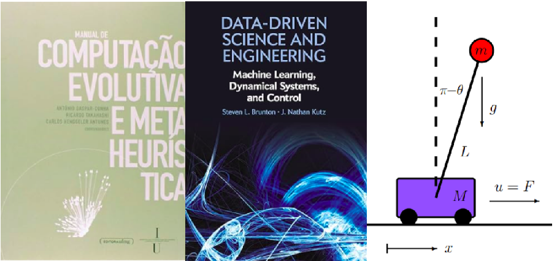

### Enio Moreira Silva Júnior
# Aplicação de Algoritmo Genético na Otimização do Controlador LQR para o Sistema Carrinho\-Pêndulo Invertido

No controle ótimo, a matriz de ganhos **K** desempenha um papel fundamental na estabilização do sistema e na eficiência do controle. O Regulador Quadrático Linear (LQR) é amplamente utilizado para minimizar uma função de custo quadrática, ajustando as matrizes de ponderação **Q** e **R**, que equilibram a estabilidade e a agressividade do controle. No entanto, a escolha inadequada dessas matrizes pode comprometer o desempenho do sistema, tornando\-o ineficiente ou economicamente inviável.


Algoritmos Genéticos (GAs), inspirados nos processos de evolução natural, têm demonstrado grande eficácia na otimização de controladores LQR, permitindo ajustar as matrizes **Q** e **R** de forma sistemática para alcançar um desempenho ideal. Este trabalho utiliza GAs para otimizar essas matrizes em um sistema carrinho\-pêndulo, com simulações realizadas no MATLAB. O código inclui uma animação do sistema, facilitando a compreensão do comportamento dinâmico sem a necessidade de acesso à planta real.

## Parâmetros iniciais do sitema:

A dinâmica do sistema é descrita pelas matrizes de estado $A$ e $B$ , onde os estados são definidos como: $x_1$ , posição do carrinho; $x_2 \textrm{,}$ velocidade do carrinho; $x_3$ , ângulo do pêndulo; e $x_4$ , velocidade angular do pêndulo. Para a simulação, adota\-se como condição inicial o sistema deslocado do equilíbrio, com $[x_1 ,x_2 ,x_3 ,x_4 ]=[0,0,\pi +0.1,0.5]$ , enquanto a referência desejada é definida como $[1,0,\pi ,0]$ . A simulação ocorre em um intervalo de 10 segundos, com passos de $0.01\;$ segundos.


Para otimizar os parâmetros do controlador LQR, foi implementado um Algoritmo Genético (GA) com os seguintes ajustes: tamanho da população igual a 500 indivíduos, número de gerações igual a 100, taxa de mutação de $5\%\;$ e passo de mutação igual a 5. A cada iteração, cinco indivíduos da população são classificados como elite, sendo mantidos diretamente na próxima geração. Além disso, é utilizada uma taxa de crossover de 1 (sempre há cruzamento). Os valores das matrizes $Q$ e $R$ estão limitados aos intervalos $[1,10^4 ]$ e $[1,10^2 ]$ , respectivamente. A população inicial é gerada aleatoriamente, com os valores de $Q$ atribuídos à sua diagonal e $R$ definido como um escalar.


```matlab
lear all, close all, clc

%% Parâmetros do sistema
m = 1; M = 5; L = 2; g = -10; d = 1;
A = [0 1 0 0;
     0 -d/M m*g/M 0;
     0 0 0 1;
     0 -d/(M*L) -(m+M)*g/(M*L) 0];
B = [0; 1/M; 0; 1/(M*L)];

% Estados: x1 = posição do carrinho, x2 = velocidade, x3 = ângulo, x4 = velocidade angular
tspan = 0:0.01:10; % Intervalo de simulação
x0 = [0; 0; pi+.1; .5]; % Condição inicial
wr = [1; 0; pi; 0]; % Referência (equilíbrio)

%% Parâmetros do algoritmo genético
popSize = 500;        % Tamanho da população
numGenerations = 100; % Número de gerações
mutationRate = 0.05;   % Taxa de mutação (5%)
mutationStep = 5;     % Passo de mutação para crescimento/redução
eliteSize = 5;        % Número de indivíduos que passam diretamente
crossoverParam = 1; % Taxa de crossover
rLimits = [1, 10e2]; % Limites de R
qLimits = [1, 10e4];    % Limites para Q
%% 
% Inicializar população (Q: valores na diagonal; R: escalar)
population = [randi(qLimits, popSize, 4), ... 
              randi(rLimits, popSize, 1)];    
%%%% Funções auxiliares
```
## Função de *Fitness*

A função *fitness* é responsável por avaliar a qualidade de cada solução no Algoritmo Genético, considerando critérios que mensuram o desempenho do sistema controlado. No caso do controlador LQR, a função *fitness* combina três índices: o erro acumulado $J_{erro}$ , o esforço de controle $J_{controle} \;$ e a estabilidade do sistema ${\textrm{Penalidade}}_{estabilidade}$ .


O índice que mapeia o erro acumulado mede o quanto os estados do sistema, $x(t)\;$ e $\theta (t)$ , se afastam da referência desejada. Ele é definido como:

&nbsp;&nbsp;&nbsp;&nbsp;&nbsp;&nbsp;&nbsp;&nbsp;&nbsp;&nbsp;&nbsp;&nbsp;&nbsp;&nbsp;&nbsp;&nbsp;&nbsp;&nbsp;&nbsp;&nbsp;&nbsp;&nbsp;&nbsp;&nbsp;&nbsp;&nbsp;&nbsp;&nbsp;&nbsp;&nbsp;&nbsp;&nbsp;&nbsp;&nbsp;&nbsp;&nbsp;&nbsp;&nbsp;&nbsp;&nbsp;&nbsp;&nbsp;&nbsp;&nbsp;&nbsp;&nbsp;&nbsp;&nbsp;&nbsp;&nbsp;&nbsp;&nbsp;&nbsp;&nbsp;&nbsp;&nbsp;&nbsp;&nbsp;&nbsp;&nbsp;&nbsp;&nbsp;&nbsp;&nbsp;&nbsp;&nbsp;&nbsp;&nbsp;&nbsp;&nbsp;&nbsp;&nbsp;&nbsp;&nbsp;&nbsp;&nbsp;&nbsp;&nbsp;&nbsp;&nbsp;&nbsp;&nbsp;&nbsp;&nbsp;&nbsp;&nbsp;&nbsp;&nbsp;&nbsp;&nbsp;&nbsp;&nbsp;&nbsp;&nbsp;&nbsp;&nbsp;&nbsp;&nbsp;&nbsp;&nbsp;&nbsp;&nbsp;&nbsp;&nbsp;&nbsp;&nbsp;&nbsp;&nbsp; $$ J_{erro} =\int_0^T e_1 \cdot \dot{e_1 } +e_2 \cdot \dot{e_2 } \,dt $$ 

Onde $e_1 \;$ é a diferença entre a posição atual do carrinho e a posição desejada; $\dot{e_1 }$ é a diferença entre a velocidade atual do carrinho e a velocidade desejada; $e_2 \;$ é a diferença entre o ângulo atual do pêndulo e o ângulo desejado; $\dot{e_2 }$ é a diferença entre a velocidade angular atual e a velocidade angular desejada; e $T$ é o tempo total da simulação.


O índice que avalia o esforço de controle penaliza valores elevados do sinal de controle \\(u(t)\\), que podem indicar um alto consumo de energia ou esforço. Ele é dado por:

&nbsp;&nbsp;&nbsp;&nbsp;&nbsp;&nbsp;&nbsp;&nbsp;&nbsp;&nbsp;&nbsp;&nbsp;&nbsp;&nbsp;&nbsp;&nbsp;&nbsp;&nbsp;&nbsp;&nbsp;&nbsp;&nbsp;&nbsp;&nbsp;&nbsp;&nbsp;&nbsp;&nbsp;&nbsp;&nbsp;&nbsp;&nbsp;&nbsp;&nbsp;&nbsp;&nbsp;&nbsp;&nbsp;&nbsp;&nbsp;&nbsp;&nbsp;&nbsp;&nbsp;&nbsp;&nbsp;&nbsp;&nbsp;&nbsp;&nbsp;&nbsp;&nbsp;&nbsp;&nbsp;&nbsp;&nbsp;&nbsp;&nbsp;&nbsp;&nbsp;&nbsp;&nbsp;&nbsp;&nbsp;&nbsp;&nbsp;&nbsp;&nbsp;&nbsp;&nbsp;&nbsp;&nbsp;&nbsp;&nbsp;&nbsp;&nbsp;&nbsp;&nbsp;&nbsp;&nbsp;&nbsp;&nbsp;&nbsp;&nbsp;&nbsp;&nbsp;&nbsp;&nbsp;&nbsp;&nbsp;&nbsp;&nbsp;&nbsp;&nbsp;&nbsp;&nbsp;&nbsp;&nbsp;&nbsp;&nbsp;&nbsp;&nbsp;&nbsp;&nbsp;&nbsp;&nbsp;&nbsp;&nbsp;&nbsp;&nbsp;&nbsp;&nbsp;&nbsp;&nbsp;&nbsp;&nbsp; $$ J_{controle} =\int_0^T u(t)^2 \,dt $$ 

Por fim, a estabilidade do sistema controlado pela matriz $Q$ é avaliada verificando os autovalores da matriz $A-BK$ . Caso algum autovalor tenha parte real $\ge 0$ , o sistema é considerado instável, e uma penalidade alta é atribuída:

&nbsp;&nbsp;&nbsp;&nbsp;&nbsp;&nbsp;&nbsp;&nbsp;&nbsp;&nbsp;&nbsp;&nbsp;&nbsp;&nbsp;&nbsp;&nbsp;&nbsp;&nbsp;&nbsp;&nbsp;&nbsp;&nbsp;&nbsp;&nbsp;&nbsp;&nbsp;&nbsp;&nbsp;&nbsp;&nbsp;&nbsp;&nbsp;&nbsp;&nbsp;&nbsp;&nbsp;&nbsp;&nbsp;&nbsp;&nbsp;&nbsp;&nbsp;&nbsp;&nbsp;&nbsp;&nbsp;&nbsp;&nbsp;&nbsp;&nbsp;&nbsp;&nbsp;&nbsp;&nbsp;&nbsp;&nbsp;&nbsp;&nbsp;&nbsp;&nbsp;&nbsp;&nbsp;&nbsp;&nbsp;&nbsp;&nbsp;&nbsp;&nbsp;&nbsp;&nbsp;&nbsp;&nbsp;&nbsp;&nbsp;&nbsp;&nbsp;&nbsp;&nbsp;&nbsp;&nbsp;&nbsp;&nbsp;&nbsp;&nbsp;&nbsp;&nbsp;&nbsp;&nbsp;&nbsp;&nbsp;&nbsp;&nbsp;&nbsp;&nbsp;&nbsp;&nbsp;&nbsp;&nbsp;&nbsp;&nbsp;&nbsp;&nbsp;&nbsp;&nbsp;&nbsp;&nbsp;&nbsp;&nbsp;&nbsp;&nbsp;&nbsp;&nbsp; $$ {\textrm{Penalidade}}_{\textrm{estabilidade}} \to +\infty $$ 


A função fitness final é então definida como:

&nbsp;&nbsp;&nbsp;&nbsp;&nbsp;&nbsp;&nbsp;&nbsp;&nbsp;&nbsp;&nbsp;&nbsp;&nbsp;&nbsp;&nbsp;&nbsp;&nbsp;&nbsp;&nbsp;&nbsp;&nbsp;&nbsp;&nbsp;&nbsp;&nbsp;&nbsp;&nbsp;&nbsp;&nbsp;&nbsp;&nbsp;&nbsp;&nbsp;&nbsp;&nbsp;&nbsp;&nbsp;&nbsp;&nbsp;&nbsp;&nbsp;&nbsp;&nbsp;&nbsp;&nbsp;&nbsp;&nbsp;&nbsp;&nbsp;&nbsp;&nbsp;&nbsp;&nbsp;&nbsp;&nbsp;&nbsp;&nbsp;&nbsp;&nbsp;&nbsp;&nbsp;&nbsp;&nbsp;&nbsp;&nbsp;&nbsp;&nbsp;&nbsp;&nbsp;&nbsp;&nbsp;&nbsp;&nbsp;&nbsp;&nbsp;&nbsp;&nbsp;&nbsp;&nbsp;&nbsp;&nbsp;&nbsp;&nbsp;&nbsp;&nbsp;&nbsp;&nbsp;&nbsp;&nbsp;&nbsp;&nbsp;&nbsp;&nbsp;&nbsp;&nbsp;&nbsp;&nbsp;&nbsp;&nbsp;&nbsp;&nbsp; $$ J=J_{erro} +\lambda \cdot J_{controle} +\beta \cdot {\textrm{Penalidade}}_{estabilidade} $$ 

onde:


Os parâmetros $\lambda$ e $\beta \;$ são pesos ajustáveis para equilibrar os critérios. Neste trabalho, utilizamos $\lambda =0.1$ e $\beta =10^6$ .

```matlab

function cost = fitnessFunction(A, B, x0, wr, tspan, qDiag, r)
    % Função de fitness para avaliar o custo acumulado
    Q = diag(qDiag); % Matriz Q com valores na diagonal
    R = r;           % Escalar R
    K = lqr(A, B, Q, R); % Calcula o controlador LQR
    u = @(x) -K * (x - wr); % Função de controle
    
    % Simular o sistema em malha fechada
    [~, x] = ode45(@(t, x) pendcart(x, 1, 5, 2, -10, 1, u(x)), tspan, x0);
    
    % Calcular custo acumulado (fitness function)
    e1 = x(:, 1) - wr(1); % Erro de posição do carrinho
    dxdte1 = x(:, 2) - wr(2); % Erro da velocidade do carrinho
    e2 = x(:, 3) - wr(3); % Erro da posição do angulo
    dxdte2 = x(:, 4) - wr(4); %Erro da velocidade angular
    
    % Calcular o erro acumulado (posição e velocidade)
    error_acc = trapz(tspan, (e1.^2).*(dxdte1.^2) + (e2.^2).*(dxdte2.^2));

    % Esforço de controle
    u_values = arrayfun(@(i) u(x(i, :)'), 1:length(tspan));
    control_effort = trapz(tspan, u_values.^2);
    
    % Penalidade de estabilidade
    eigs = eig(A - B * K);
    if any(real(eigs) >= 0)
        penalty = 1e6; % Penalidade alta para instabilidade
    else
        penalty = 0;
    end

    cost = error_acc + 0.1 * control_effort + penalty;
end
```
## Seleção por Torneio

Consiste em selecionar aleatoriamente um pequeno grupo de indivíduos e, em seguida, escolher o melhor dentro desse grupo para se reproduzir. Logo, desempenha um papel fundamental em guiar o processo de evolução no algoritmo genético, ajudando a promover a busca por soluções melhores ao longo das gerações.

```matlab

function selected = tournamentSelection(fitness)
    % Seleção por torneio
    tournamentSize = 3;
    competitors = randi(length(fitness), tournamentSize, 1);
    [~, bestIdx] = min(fitness(competitors));
    selected = competitors(bestIdx);
end
```
## Mutação

A mutação em algoritmos genéticos é um mecanismo de variabilidade que introduz aleatoriedade na solução para evitar que a busca por soluções ótimas fique presa em pontos locais. A mutação consiste em alterar aleatoriamente um ou mais genes de um indivíduo, com uma determinada taxa de mutação, promovendo a diversidade genética da população. A mutação ajuda a explorar novas regiões do espaço de busca, contribuindo para encontrar soluções melhores ou inovadoras que não seriam geradas apenas pela recombinação (*crossover*) entre indivíduos.

```matlab

function mutated = mutate(individual, mutationRate, mutationStep, qLimits, rLimits)
    % Mutação para permitir crescimento ou redução dos valores
    mutated = individual;
    for i = 1:length(individual)
        if rand < mutationRate
            delta = mutationStep * (2 * rand - 1); % Mutação entre [-step, +step]
            mutated(i) = individual(i) + delta;
            % Restringir dentro dos limites
            if i <= 4 % Para Q
                mutated(i) = max(qLimits(1), min(qLimits(2), mutated(i)));
            else % Para R
                mutated(i) = max(rLimits(1), min(rLimits(2), mutated(i)));
            end
        end
    end
end
```
## Função main (*loop*)

O loop implementa a execução do algoritmo genético para otimização dos parâmetros $Q\;$ e $R\;$ de um controlador LQR. Para cada geração, o fitness de cada indivíduo da população é avaliado usando a função de fitness, que calcula o desempenho do controlador com base nos parâmetros $Q$ e $R$ . Em seguida, os indivíduos são ordenados com base no seu fitness (menor custo é melhor), e a elite (os melhores indivíduos) é preservada para a próxima geração. A partir dessa elite, os novos indivíduos são gerados através de recombinação (*crossover*) e mutação, garantindo que as novas soluções sejam baseadas em combinações dos melhores cromossomos. O processo é repetido até atingir o número máximo de gerações, e a cada geração o melhor fitness encontrado é registrado. Ao final, a melhor solução é extraída, exibindo os valores de $Q$ , $R$ , e a matriz de controle $K\;$ do controlador LQR, que é calculada com base nos melhores parâmetros encontrados. O histórico do melhor fitness ao longo das gerações é também plotado para visualizar o progresso do algoritmo.


```matlab
 %% Algoritmo Genético
bestFitnessHistory = zeros(numGenerations, 1); % Vetor para armazenar o melhor fitness de cada geração

for generation = 1:numGenerations
    % Avaliar fitness de cada indivíduo
    fitness = arrayfun(@(i) fitnessFunction(A, B, x0, wr, tspan, ...
                   population(i, 1:4), population(i, 5)), 1:popSize);
    
    % Seleção dos melhores indivíduos (menor custo = melhor)
    [~, sortedIdx] = sort(fitness); % Ordenar pela fitness (crescente)
    elite = population(sortedIdx(1:eliteSize), :); % Elite
    bestFitness = fitness(sortedIdx(1)); % Melhor fitness da geração

    % Guarda histórico dos melhores indivíduos
     bestFitnessHistory(generation) = bestFitness;
    
    % Recombinar para nova população
    newPopulation = elite; % Preserva elite
    for i = eliteSize+1:popSize
        % Seleção de dois pais (torneio)
        parent1 = population(tournamentSelection(fitness), :);
        parent2 = population(tournamentSelection(fitness), :);
        
        % Crossover
        if rand < crossoverParam
            alpha = rand(); % Fator de interpolação
            child = alpha * parent1 + (1 - alpha) * parent2;
        else
            child = parent1; % Sem crossover
        end
        
        % Mutação
        child = mutate(child, mutationRate, mutationStep, qLimits, rLimits);
        newPopulation(i, :) = child;
    end
    
    % Atualizar população
    population = newPopulation;
    
    % Exibir progresso
    fprintf('Geração %d | Melhor Fitness: %.4f\n', generation, bestFitness);
end

%% Melhor solução encontrada
bestIndividual = population(1, :);
bestQ = diag(bestIndividual(1:4));
bestR = bestIndividual(5);

fprintf('\nMelhor Solução:\n');
disp('Matriz Q:');
disp(bestQ);
disp('Valor de R:');
disp(bestR);
%% 

K = lqr(A,B,bestQ,bestR);
disp(K)
%% % Plotar o gráfico do melhor fitness ao longo das gerações
figure;
plot(1:numGenerations, bestFitnessHistory, 'LineWidth', 2);
xlabel('Geração');
ylabel('Melhor Fitness');
title('Melhor Fitness por Geração');
grid on;

```
